# 🌐 Guía Frontend Multi-Tenancy - Detección Dinámica de Subdominios

## 🎯 Objetivo

Configurar el frontend para que **detecte automáticamente** el subdominio y se conecte al tenant correcto en el backend.

### **Ejemplos de Funcionamiento:**

```
https://clinica1.psicoadmin.xyz → Backend: clinica1 (Clínica Dental Norte)
https://clinica2.psicoadmin.xyz → Backend: clinica2 (Clínica Dental Sur)
https://psicoadmin.xyz          → Backend: public (Sistema Central)
```

---

## 📋 Tabla de Contenidos

1. [Configuración del Frontend](#1-configuración-del-frontend)
2. [Detección Dinámica de Subdominio](#2-detección-dinámica-de-subdominio)
3. [Configuración de Axios/Fetch](#3-configuración-de-axiosfetch)
4. [Componente de Login Mejorado](#4-componente-de-login-mejorado)
5. [Manejo de Errores](#5-manejo-de-errores)
6. [Testing Local](#6-testing-local)
7. [Deployment](#7-deployment)

---

## 1. Configuración del Frontend

### **1.1. Variables de Entorno (.env)**

Crea o actualiza tu archivo `.env`:

```bash
# Desarrollo Local (con subdominios)
VITE_API_BASE_URL=http://localhost:8000/api
VITE_DOMAIN_BASE=localhost:8000
VITE_USE_SUBDOMAIN=true

# Producción (Render + psicoadmin.xyz)
# VITE_API_BASE_URL=https://clinicadental-backend.onrender.com/api
# VITE_DOMAIN_BASE=psicoadmin.xyz
# VITE_USE_SUBDOMAIN=true
```

### **1.2. Configuración de Vite (vite.config.js)**

Para desarrollo local con subdominios:

```javascript
import { defineConfig } from 'vite'
import react from '@vitejs/plugin-react'

export default defineConfig({
  plugins: [react()],
  server: {
    host: '0.0.0.0', // Permite acceso desde subdominios
    port: 5173,
    strictPort: true,
    // Permitir subdominios en desarrollo
    allowedHosts: [
      'localhost',
      '.localhost',
      'clinica1.localhost',
      'clinica2.localhost',
      '.psicoadmin.xyz',
    ]
  }
})
```

---

## 2. Detección Dinámica de Subdominio

### **2.1. Utilidad para Detectar Tenant (utils/tenant.js)**

```javascript
/**
 * Detecta el subdominio actual y retorna información del tenant
 */

export const getTenantInfo = () => {
  const hostname = window.location.hostname;
  const parts = hostname.split('.');
  
  // Configuración desde .env
  const isDevelopment = import.meta.env.DEV;
  const baseDomain = import.meta.env.VITE_DOMAIN_BASE || 'psicoadmin.xyz';
  
  let subdomain = null;
  let isPublic = false;
  
  // DESARROLLO LOCAL (*.localhost:5173)
  if (isDevelopment || hostname.includes('localhost')) {
    if (parts.length > 1 && parts[0] !== 'localhost') {
      // clinica1.localhost -> subdomain = 'clinica1'
      subdomain = parts[0];
    } else {
      // localhost -> tenant público
      isPublic = true;
    }
  }
  // PRODUCCIÓN (*.psicoadmin.xyz)
  else {
    if (parts.length > 2) {
      // clinica1.psicoadmin.xyz -> subdomain = 'clinica1'
      subdomain = parts[0];
    } else if (hostname === baseDomain || hostname === `www.${baseDomain}`) {
      // psicoadmin.xyz o www.psicoadmin.xyz -> tenant público
      isPublic = true;
    }
  }
  
  return {
    subdomain,
    isPublic,
    hostname,
    tenantId: subdomain || 'public',
    displayName: subdomain ? `Clínica ${subdomain}` : 'Sistema Central'
  };
};

/**
 * Obtiene la URL base del API según el tenant actual
 */
export const getApiBaseUrl = () => {
  const isDevelopment = import.meta.env.DEV;
  const { subdomain, isPublic } = getTenantInfo();
  
  if (isDevelopment) {
    // Desarrollo: siempre localhost:8000
    return 'http://localhost:8000/api';
  }
  
  // Producción: Render
  // El backend maneja el routing por subdominio
  if (subdomain) {
    // Opción 1: Subdominios separados (si los configuras en Render)
    return `https://${subdomain}.psicoadmin.xyz/api`;
    
    // Opción 2: Enviar header personalizado al mismo backend
    // return 'https://clinicadental-backend.onrender.com/api';
  }
  
  // Público
  return 'https://clinicadental-backend.onrender.com/api';
};

/**
 * Genera el header personalizado para multi-tenancy (alternativa)
 */
export const getTenantHeader = () => {
  const { subdomain } = getTenantInfo();
  return subdomain ? { 'X-Tenant-Subdomain': subdomain } : {};
};

/**
 * Verifica si el usuario puede acceder a este tenant
 */
export const validateTenantAccess = (userTenant, currentTenant) => {
  // Admin global puede acceder a cualquier tenant
  if (userTenant === 'public' || userTenant === 'admin') {
    return true;
  }
  
  // Usuario normal solo puede acceder a su tenant
  return userTenant === currentTenant;
};

/**
 * Redirige al subdominio correcto según el tenant del usuario
 */
export const redirectToTenant = (tenantId) => {
  const isDevelopment = import.meta.env.DEV;
  const currentTenant = getTenantInfo().tenantId;
  
  // Ya está en el tenant correcto
  if (currentTenant === tenantId) {
    return;
  }
  
  // Construir URL del tenant
  let targetUrl;
  if (isDevelopment) {
    targetUrl = tenantId === 'public' 
      ? 'http://localhost:5173'
      : `http://${tenantId}.localhost:5173`;
  } else {
    targetUrl = tenantId === 'public'
      ? 'https://psicoadmin.xyz'
      : `https://${tenantId}.psicoadmin.xyz`;
  }
  
  // Redirigir
  window.location.href = targetUrl;
};
```

---

## 3. Configuración de Axios/Fetch

### **3.1. Cliente API con Axios (services/api.js)**

```javascript
import axios from 'axios';
import { getApiBaseUrl, getTenantHeader, getTenantInfo } from '../utils/tenant';

// Crear instancia de Axios
const api = axios.create({
  baseURL: getApiBaseUrl(),
  timeout: 10000,
  headers: {
    'Content-Type': 'application/json',
    ...getTenantHeader() // Header personalizado con subdominio
  }
});

// Interceptor para agregar token de autenticación
api.interceptors.request.use(
  (config) => {
    const token = localStorage.getItem('authToken');
    if (token) {
      config.headers.Authorization = `Token ${token}`;
    }
    
    // Re-agregar header de tenant en cada petición
    const tenantHeaders = getTenantHeader();
    config.headers = { ...config.headers, ...tenantHeaders };
    
    // Log para debugging (remover en producción)
    console.log(`[API] ${config.method?.toUpperCase()} ${config.url}`, {
      tenant: getTenantInfo().tenantId,
      headers: config.headers
    });
    
    return config;
  },
  (error) => {
    return Promise.reject(error);
  }
);

// Interceptor para manejar errores
api.interceptors.response.use(
  (response) => {
    return response;
  },
  (error) => {
    // Error 404: Tenant no encontrado
    if (error.response?.status === 404 && error.response?.data?.error?.includes('tenant')) {
      console.error('❌ Tenant no encontrado:', getTenantInfo().tenantId);
      // Redirigir al público
      window.location.href = import.meta.env.DEV 
        ? 'http://localhost:5173'
        : 'https://psicoadmin.xyz';
    }
    
    // Error 401: No autenticado
    if (error.response?.status === 401) {
      localStorage.removeItem('authToken');
      localStorage.removeItem('userData');
      window.location.href = '/login';
    }
    
    return Promise.reject(error);
  }
);

export default api;
```

### **3.2. Servicio de Autenticación (services/auth.js)**

```javascript
import api from './api';
import { getTenantInfo, validateTenantAccess, redirectToTenant } from '../utils/tenant';

export const authService = {
  /**
   * Login de usuario
   */
  async login(email, password) {
    try {
      const tenantInfo = getTenantInfo();
      console.log('🔐 Intentando login en:', tenantInfo.displayName);
      
      const response = await api.post('/autenticacion/login/', {
        correoelectronico: email,
        password: password
      });
      
      const { token, usuario } = response.data;
      
      // Guardar en localStorage
      localStorage.setItem('authToken', token);
      localStorage.setItem('userData', JSON.stringify(usuario));
      
      // Validar acceso al tenant actual
      const userTenant = usuario.tenant_id || usuario.clinica_schema || 'public';
      const currentTenant = tenantInfo.tenantId;
      
      if (!validateTenantAccess(userTenant, currentTenant)) {
        console.warn('⚠️ Usuario pertenece a otro tenant, redirigiendo...');
        redirectToTenant(userTenant);
        return null;
      }
      
      console.log('✅ Login exitoso:', usuario.nombre);
      return { token, usuario };
      
    } catch (error) {
      console.error('❌ Error en login:', error.response?.data || error.message);
      throw error;
    }
  },

  /**
   * Logout
   */
  logout() {
    localStorage.removeItem('authToken');
    localStorage.removeItem('userData');
    window.location.href = '/login';
  },

  /**
   * Obtener usuario actual
   */
  getCurrentUser() {
    const userData = localStorage.getItem('userData');
    return userData ? JSON.parse(userData) : null;
  },

  /**
   * Verificar si está autenticado
   */
  isAuthenticated() {
    return !!localStorage.getItem('authToken');
  },

  /**
   * Verificar tenant del usuario
   */
  async verifyTenant() {
    try {
      const response = await api.get('/autenticacion/verify-tenant/');
      return response.data;
    } catch (error) {
      console.error('Error verificando tenant:', error);
      return null;
    }
  }
};
```

---

## 4. Componente de Login Mejorado

### **4.1. LoginPage.jsx**

```jsx
import React, { useState, useEffect } from 'react';
import { useNavigate } from 'react-router-dom';
import { authService } from '../services/auth';
import { getTenantInfo } from '../utils/tenant';

const LoginPage = () => {
  const [email, setEmail] = useState('');
  const [password, setPassword] = useState('');
  const [loading, setLoading] = useState(false);
  const [error, setError] = useState('');
  const [tenantInfo, setTenantInfo] = useState(null);
  
  const navigate = useNavigate();

  useEffect(() => {
    // Detectar tenant al cargar
    const info = getTenantInfo();
    setTenantInfo(info);
    console.log('🏥 Tenant detectado:', info);
    
    // Si ya está autenticado, redirigir
    if (authService.isAuthenticated()) {
      navigate('/dashboard');
    }
  }, [navigate]);

  const handleSubmit = async (e) => {
    e.preventDefault();
    setLoading(true);
    setError('');

    try {
      const result = await authService.login(email, password);
      
      if (result) {
        // Login exitoso en el tenant correcto
        navigate('/dashboard');
      }
      // Si result es null, significa que fue redirigido a otro tenant
      
    } catch (err) {
      setError(
        err.response?.data?.error || 
        err.response?.data?.message ||
        'Error al iniciar sesión. Verifica tus credenciales.'
      );
    } finally {
      setLoading(false);
    }
  };

  return (
    <div className="min-h-screen flex items-center justify-center bg-gradient-to-br from-blue-50 to-indigo-100">
      <div className="max-w-md w-full bg-white rounded-2xl shadow-xl p-8">
        
        {/* Header con información del tenant */}
        <div className="text-center mb-8">
          <div className="inline-flex items-center justify-center w-16 h-16 bg-blue-100 rounded-full mb-4">
            <svg className="w-8 h-8 text-blue-600" fill="none" stroke="currentColor" viewBox="0 0 24 24">
              <path strokeLinecap="round" strokeLinejoin="round" strokeWidth={2} d="M19 21V5a2 2 0 00-2-2H7a2 2 0 00-2 2v16m14 0h2m-2 0h-5m-9 0H3m2 0h5M9 7h1m-1 4h1m4-4h1m-1 4h1m-5 10v-5a1 1 0 011-1h2a1 1 0 011 1v5m-4 0h4" />
            </svg>
          </div>
          
          <h2 className="text-3xl font-bold text-gray-900">
            {tenantInfo?.displayName || 'Clínica Dental'}
          </h2>
          
          <p className="text-sm text-gray-500 mt-2">
            {tenantInfo?.isPublic ? 'Sistema Central' : `Tenant: ${tenantInfo?.tenantId}`}
          </p>
          
          {/* Indicador de ambiente */}
          <div className="mt-2 inline-flex items-center px-3 py-1 rounded-full text-xs font-medium bg-blue-100 text-blue-800">
            {import.meta.env.DEV ? '🔧 Desarrollo' : '🌐 Producción'}
          </div>
        </div>

        {/* Formulario */}
        <form onSubmit={handleSubmit} className="space-y-6">
          
          {/* Email */}
          <div>
            <label className="block text-sm font-medium text-gray-700 mb-2">
              Correo Electrónico
            </label>
            <input
              type="email"
              value={email}
              onChange={(e) => setEmail(e.target.value)}
              required
              className="w-full px-4 py-3 border border-gray-300 rounded-lg focus:ring-2 focus:ring-blue-500 focus:border-transparent transition"
              placeholder="usuario@clinica.com"
              disabled={loading}
            />
          </div>

          {/* Password */}
          <div>
            <label className="block text-sm font-medium text-gray-700 mb-2">
              Contraseña
            </label>
            <input
              type="password"
              value={password}
              onChange={(e) => setPassword(e.target.value)}
              required
              className="w-full px-4 py-3 border border-gray-300 rounded-lg focus:ring-2 focus:ring-blue-500 focus:border-transparent transition"
              placeholder="••••••••"
              disabled={loading}
            />
          </div>

          {/* Error */}
          {error && (
            <div className="bg-red-50 border border-red-200 text-red-700 px-4 py-3 rounded-lg">
              <p className="text-sm">{error}</p>
            </div>
          )}

          {/* Botón Submit */}
          <button
            type="submit"
            disabled={loading}
            className="w-full bg-blue-600 hover:bg-blue-700 text-white font-semibold py-3 px-4 rounded-lg transition duration-200 disabled:opacity-50 disabled:cursor-not-allowed flex items-center justify-center"
          >
            {loading ? (
              <>
                <svg className="animate-spin -ml-1 mr-3 h-5 w-5 text-white" fill="none" viewBox="0 0 24 24">
                  <circle className="opacity-25" cx="12" cy="12" r="10" stroke="currentColor" strokeWidth="4"></circle>
                  <path className="opacity-75" fill="currentColor" d="M4 12a8 8 0 018-8V0C5.373 0 0 5.373 0 12h4zm2 5.291A7.962 7.962 0 014 12H0c0 3.042 1.135 5.824 3 7.938l3-2.647z"></path>
                </svg>
                Iniciando sesión...
              </>
            ) : (
              'Iniciar Sesión'
            )}
          </button>
        </form>

        {/* Footer con credenciales de prueba (solo desarrollo) */}
        {import.meta.env.DEV && (
          <div className="mt-6 p-4 bg-yellow-50 border border-yellow-200 rounded-lg">
            <p className="text-xs font-semibold text-yellow-800 mb-2">🧪 Credenciales de Prueba:</p>
            <div className="space-y-1 text-xs text-yellow-700">
              <p>Admin: <code className="bg-yellow-100 px-1 rounded">admin@clinica1.com</code> / <code className="bg-yellow-100 px-1 rounded">admin123</code></p>
              <p>Odontólogo: <code className="bg-yellow-100 px-1 rounded">dr.perez@clinica1.com</code> / <code className="bg-yellow-100 px-1 rounded">odontologo123</code></p>
            </div>
          </div>
        )}
      </div>
    </div>
  );
};

export default LoginPage;
```

---

## 5. Manejo de Errores

### **5.1. Componente de Error 404 Tenant (TenantNotFound.jsx)**

```jsx
import React from 'react';
import { getTenantInfo } from '../utils/tenant';

const TenantNotFound = () => {
  const tenantInfo = getTenantInfo();
  
  const goToPublic = () => {
    window.location.href = import.meta.env.DEV 
      ? 'http://localhost:5173'
      : 'https://psicoadmin.xyz';
  };

  return (
    <div className="min-h-screen flex items-center justify-center bg-gray-50">
      <div className="text-center max-w-md">
        <div className="text-6xl mb-4">🏥</div>
        <h1 className="text-4xl font-bold text-gray-900 mb-4">
          Clínica No Encontrada
        </h1>
        <p className="text-gray-600 mb-2">
          El tenant <strong className="text-blue-600">{tenantInfo.tenantId}</strong> no existe o no está activo.
        </p>
        <p className="text-sm text-gray-500 mb-8">
          Verifica que el subdominio sea correcto.
        </p>
        <button
          onClick={goToPublic}
          className="bg-blue-600 hover:bg-blue-700 text-white font-semibold py-3 px-6 rounded-lg transition"
        >
          Ir al Sistema Central
        </button>
      </div>
    </div>
  );
};

export default TenantNotFound;
```

---

## 6. Testing Local

### **6.1. Configurar Hosts (Windows)**

Edita `C:\Windows\System32\drivers\etc\hosts` (como Administrador):

```
127.0.0.1 localhost
127.0.0.1 clinica1.localhost
127.0.0.1 clinica2.localhost
127.0.0.1 public.localhost
```

### **6.2. Probar Subdominios**

```bash
# Terminal 1: Backend Django
python manage.py runserver 0.0.0.0:8000

# Terminal 2: Frontend Vite
npm run dev -- --host 0.0.0.0
```

**URLs de prueba:**
- `http://localhost:5173` → Tenant público
- `http://clinica1.localhost:5173` → Clínica 1
- `http://clinica2.localhost:5173` → Clínica 2

---

## 7. Deployment

### **7.1. Vercel con Subdominios Wildcard**

```json
// vercel.json
{
  "buildCommand": "npm run build",
  "outputDirectory": "dist",
  "rewrites": [
    { "source": "/(.*)", "destination": "/index.html" }
  ],
  "headers": [
    {
      "source": "/(.*)",
      "headers": [
        {
          "key": "Access-Control-Allow-Origin",
          "value": "*"
        }
      ]
    }
  ]
}
```

**Configurar dominio en Vercel:**
1. Dashboard → Settings → Domains
2. Agregar: `*.psicoadmin.xyz`
3. Configurar DNS wildcard CNAME

### **7.2. DNS Wildcard (Hostinger/Cloudflare)**

```
Tipo: CNAME
Nombre: *
Valor: clinica-frontend.vercel.app
TTL: Automático
```

---

## 8. Resumen de Flujo

```mermaid
graph TD
    A[Usuario accede a clinica1.psicoadmin.xyz] --> B{Detectar Subdominio}
    B --> C[getTenantInfo retorna 'clinica1']
    C --> D[API configura header X-Tenant-Subdomain: clinica1]
    D --> E[Backend busca en comun_dominio WHERE domain='clinica1.psicoadmin.xyz']
    E --> F{Tenant existe?}
    F -->|Sí| G[Conectar al schema 'clinica1']
    F -->|No| H[Retornar 404 + Error]
    G --> I[Login exitoso]
    H --> J[Redirigir a tenant público]
```



---

## 🎉 ¡Listo!

Ahora tu frontend:
- ✅ Detecta automáticamente el subdominio
- ✅ Se conecta al tenant correcto
- ✅ Maneja errores de tenant no encontrado
- ✅ Redirige usuarios al tenant correcto
- ✅ Funciona en desarrollo y producción

**Pruébalo ejecutando el seeder en Render y accediendo a:**
- `https://clinicadental-backend.onrender.com` (público)
- `https://clinica1.psicoadmin.xyz` (clínica 1, después de DNS)
